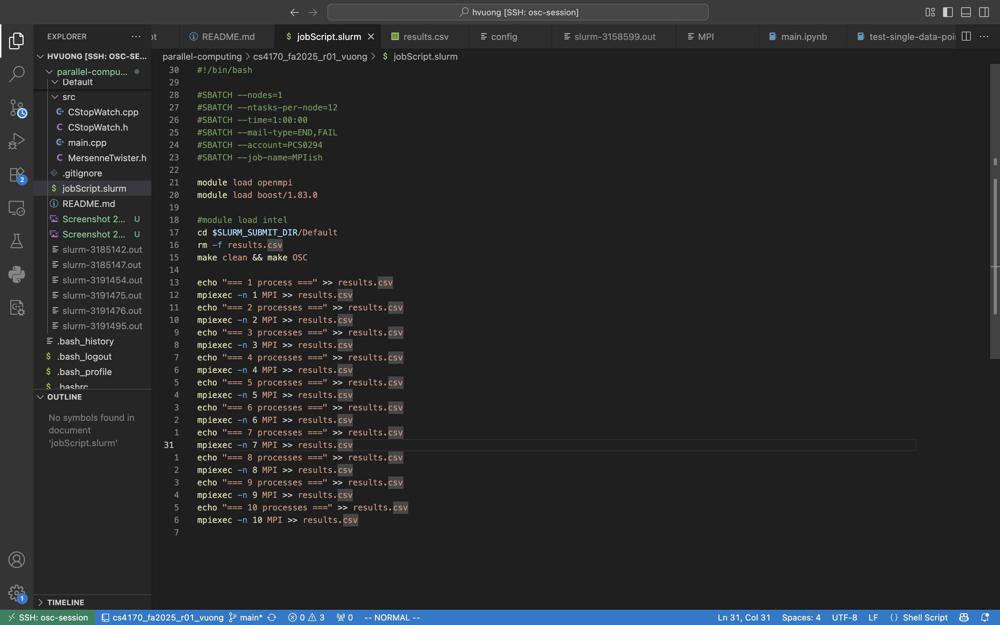
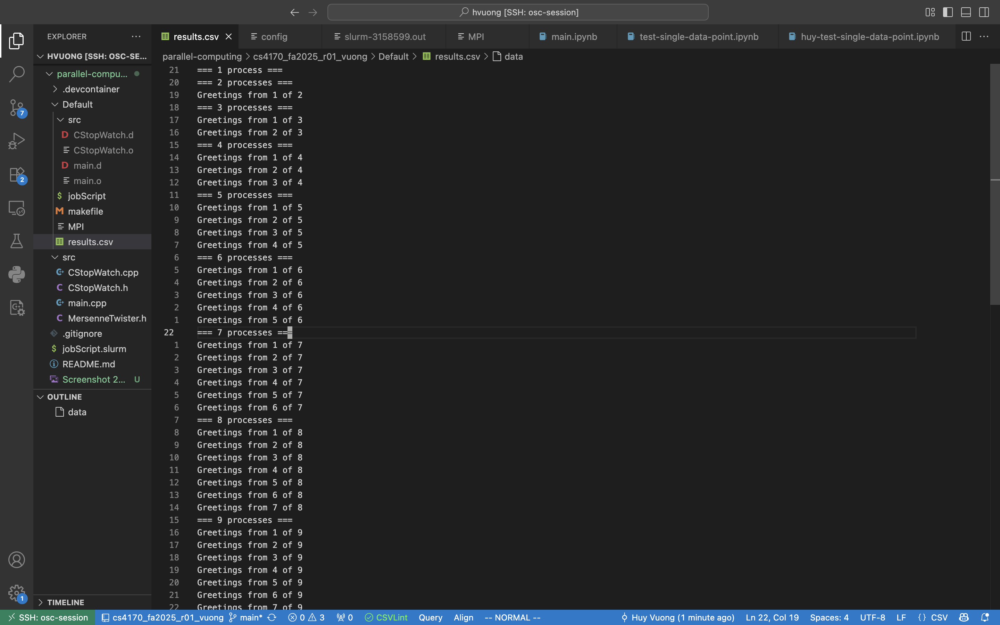
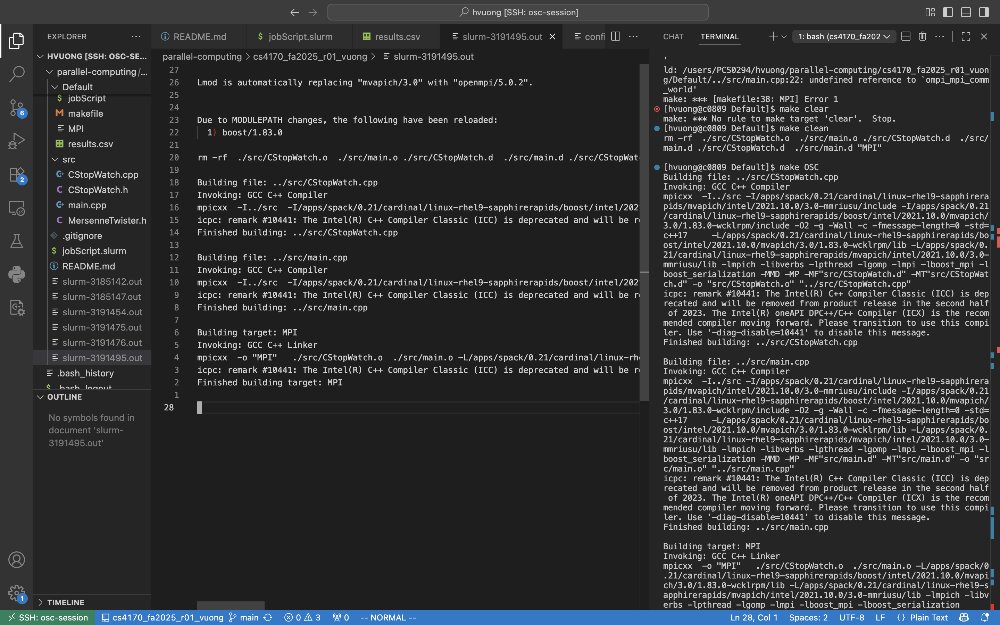

## Results

### Modified job script to use 1 to 10 cores

### Results of mpirun command from 1 to 10 cores

### Output of sbatch command

## Summary of What I Learned

I have learned:

-   Basic MPI commands:

    -   `MPI_Init`: to initialize the MPI environment, all processes must call this before any other MPI functions
    -   `MPI_Finalize`: to clean up the MPI environment, all processes must call this as the last MPI function
    -   `MPI_Comm_size`: to get the number of processes in a communicator
    -   `MPI_Comm_rank`: to get the rank of the calling process in a communicator
    -   `MPI_Send`: to send a message to another process
    -   `MPI_Recv`: to receive a message from another process, a buffer must be provided to store the incoming message
    -   `MPI_Probe`: to check for incoming messages
    -   `MPI_Get_count`: to get the number of elements in a received message

-   MPI concepts:

    -   Master process (rank 0) and worker processes (other ranks)
    -   The number of processes = number of cores - 1 (1 core for OS)

-   Parallel programming concepts:

    -   We need parallel programming because single core performance improvements have plateaued, and many applications require more computational power than a single core can provide.
    -   In a code there will be serial parts and parallel parts. The serial parts can only be executed by one core, while the parallel parts can be executed by multiple cores simultaneously.
    -   Amdahl's Law: the speedup of a program using multiple processors is limited by the serial portion of the program. The formula is: Speedup ≤ 1 / (S + P/N), where S is the fraction of the program that is serial, P is the fraction that can be parallelized, and N is the number of processors.
    -   The more cores we use, the less speedup we get due to the serial portion of the code and communication overhead.
    -   The more cores we use, the lower the efficiency we get.
    -   To parallelize a program, we need to identify the parallelizable parts and distribute the workload among multiple processes.

## Issues I ran into

-   I ran into issue running the Docker container on my M1 MacBook Air.
-   Also I have minor issue with loading boost in OSC.

## How much time did you spend on this reflection? How much time did you spending coding? Writing? Testing? Analyzing?

-   I spent about 30 minutes on this reflection. I spent around 30 minutes coding, 1 hour writing, 30 minutes testing, and 30 minutes analyzing.
